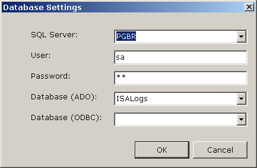



## Enumerate SQL Servers & DBs \(working on Win 9x\)

### Description

This sample project enumerate all active SQL servers in LAN using ODBC function SQLBrowseConnect. This method is working both for NT and 9x based OSes. The behaviour of this ODBC function is changed in MDAC 2.6 to include all SQL Server instances found on each machine. In MDAC prios 2.6 it's enumerating servers listening on named pipes while after this release its using NetBIOS broadcasts over TCP/IP to receive response from the active servers. The code is compactly written in decoupled module and a form. The module is easy to be recycled in projects of yours and the form can be studied as a sample GUI to it. Enjoy!
 
### More Info
 

             |
---                |---
**Submitted On**   |2002-11-17 09:52:04
**By**             |[Vlad Vissoultchev](https://github.com/Planet-Source-Code/PSCIndex/blob/master/ByAuthor/vlad-vissoultchev.md)
**Level**          |Beginner
**User Rating**    |5.0 (25 globes from 5 users)
**Compatibility**  |VB 6\.0
**Category**       |[Databases/ Data Access/ DAO/ ADO](https://github.com/Planet-Source-Code/PSCIndex/blob/master/ByCategory/databases-data-access-dao-ado__1-6.md)
**World**          |[Visual Basic](https://github.com/Planet-Source-Code/PSCIndex/blob/master/ByWorld/visual-basic.md)
**Archive File**   |[Enumerate\_14989211172002\.zip](https://github.com/Planet-Source-Code/vlad-vissoultchev-enumerate-sql-servers-dbs-working-on-win-9x__1-40805/archive/master.zip)

